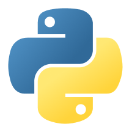
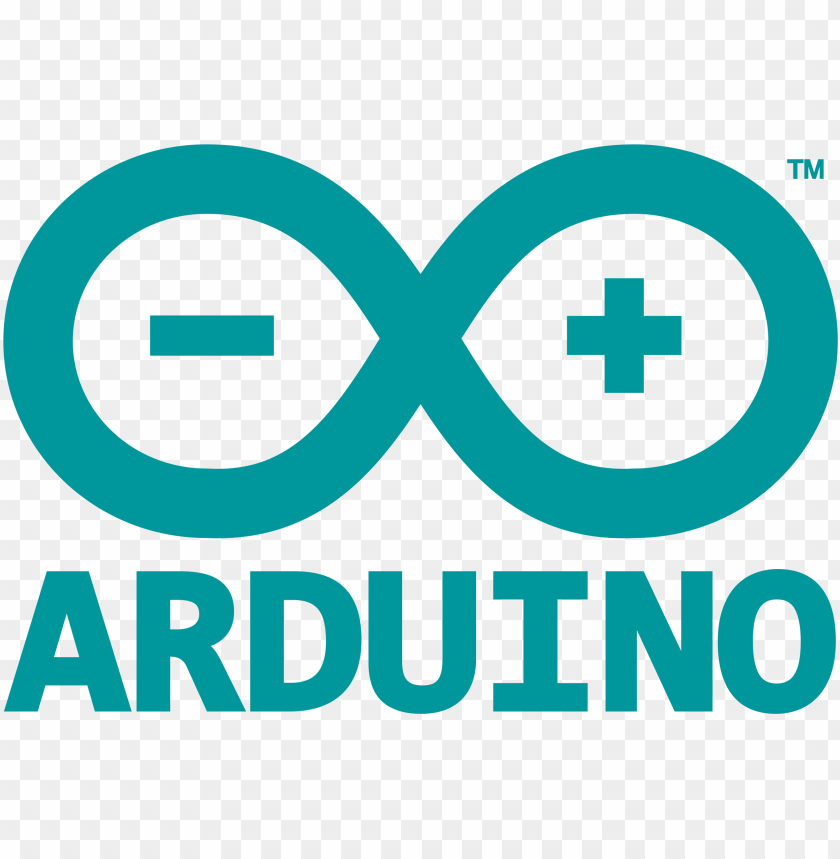

  👋 Hi! I'm gradwohlandco — currently training as an electrical engineer with a strong interest in software development and IT systems. I work in industrial engineering at a large sensor manufacturer, where I gain hands-on experience with real-world technical systems.
    
  My focus is on building a strong foundation in both software and hardware — especially where they intersect, such as embedded systems and industrial applications.
    
  I already work with technologies like C, Arduino, Python, HTML, CSS, JavaScript, REST APIs, PHP, SQL, and Git. I'm continuously expanding my knowledge through projects and hands-on experimentation.
    
  This page serves as a structured overview of my learning journey, projects, and technical growth as I move deeper into software development.

---

## 🚀 Preferred Tech Stack

### Frontend

  
  
  

### Backend / Scripting

  
  
  

### Embedded / Hardware

  
  

### Tools

  
  

---

## 🐍 Snake Animation

